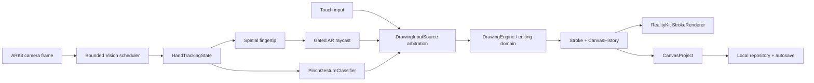

# AirCanvas

**AirCanvas** is a native iOS spatial drawing app that lets people create and edit strokes in the space around them using hand tracking and pinch interaction—with full touch alternatives for essential editing.

Built in Swift for iPhone, AirCanvas combines ARKit, RealityKit, and on-device Vision hand tracking with a persistent, testable drawing domain. The core product implementation is complete, and its final QA implementation and automated phase are complete. Real-iPhone development deployment and the earlier physical validation milestones are complete; the status record retains one final current-build physical QA and demo-rehearsal pass before that separate Milestone 32 gate is closed. Apple Distribution, TestFlight, and App Store Connect remain intentionally deferred while the project uses a Personal Team.

## What it does

- Draws spatial strokes with a tracked fingertip and confirmed pinch gesture.
- Supports touch drawing when hand tracking is unavailable or not preferred.
- Provides Draw, Select, Move, Scale, Rotate, Erase, explicit Delete, Undo, and Redo.
- Stores independent local canvases with stable UUID identities and revision-aware autosave.
- Recovers from interrupted writes with atomic publication and a bounded last-known-good backup.
- Imports and exports versioned `.aircanvas` documents and exports PNG artwork.
- Includes a real first-run onboarding flow for camera permission, AR readiness, hand readiness, pinch verification, and a first committed Stroke.
- Preserves accessibility through VoiceOver semantics, Dynamic Type, Reduce Motion, color-independent state, and touch-first alternatives.

## Interaction model

Hand input is an enhancement, not the only way to use AirCanvas.

| Task | Hand interaction | Touch-accessible alternative |
|---|---|---|
| Draw | Point, pinch, move, release | Drag on the spatial canvas |
| Select | Point at or pinch a stroke | Tap a stroke |
| Move | Pinch and move a selected stroke | Drag a selected stroke in Select mode |
| Scale / Rotate | Use the selected-stroke controls | Native accessible sliders |
| Delete | Explicit selected-stroke Delete | Same explicit Delete control |
| Erase | Pinch once on a highlighted candidate | Explicit Select + Delete |

## Architecture

AirCanvas has one production AR session and one bounded Vision path. Onboarding observes the same production runtime rather than creating tutorial-only AR, Vision, pinch, drawing, cursor, or Stroke systems.

### Key engineering decisions

- **Shared domain path:** hand and touch interactions converge through the same `DrawingEngine`, history, renderer, and persistence paths.
- **Input arbitration:** `DrawingInputSource` ensures hand and touch cannot mutate the same active Stroke concurrently.
- **Stable identity:** canvases and strokes use UUIDs; names are presentation metadata, never identity.
- **Safe transforms:** move, scale, and rotation previews start from immutable original snapshots, avoiding cumulative drift.
- **Intentional destruction:** hover never erases. Spatial erase requires one confirmed pinch per candidate; explicit deletion is undoable.
- **Lifecycle safety:** hand loss, tracking loss, permission loss, backgrounding, and tool changes cancel incomplete interactions before cleanup and save.

## Hand tracking and spatial drawing

The sole `ARSession` supplies transient camera frames to an on-device Vision hand-pose coordinator. The coordinator processes at most one request at a time and retains only the latest pending frame. Confidence-validated landmarks feed a framework-independent pinch classifier with hysteresis, confirmation, and hand-loss handling.

An accepted fingertip is raycast through the live AR scene before it can route a drawing or editing interaction. A confirmed pinch starts a normal stroke; release commits it through the same renderer, history, autosave, and persistence behavior used by touch drawing.

## Persistence and portability

Canvases are local, UUID-keyed documents stored in Application Support. Semantic mutations advance a document revision and enter a coalesced autosave path. Writes are validated and atomically published; one bounded backup supports recovery from a damaged primary document. Backgrounding, editor exit, and export request a safety flush without treating temporary shared files as authoritative content.

The portable format is `com.aircanvas.document` with the `.aircanvas` extension and schema version 1. Imports validate format, schema, geometry, limits, and duplicate IDs before creating an independent local canvas. Exports deliberately omit local runtime state, history, repository paths, and AR world maps.

## Accessibility and UX

AirCanvas was designed so spatial hand interaction does not block practical use:

- VoiceOver labels, values, selected-state feedback, and stable control identifiers.
- Dynamic Type support through accessibility sizes.
- Reduce Motion support for app-generated UI motion.
- Differentiate Without Color support and text/icon/border state cues.
- Light and Dark Mode support with material-backed camera overlays for legibility.
- Accessible Scale and Rotate controls, explicit destructive actions, and touch-only editing workflows.

High-frequency AR, Vision, cursor, and StrokePoint updates are intentionally not announced to assistive technologies.

## Performance and reliability

AirCanvas reuses a single production performance policy:

- One Vision request in flight with at most one latest pending frame.
- Generation/sequence protection that rejects stale Vision results.
- Vision cadence bounded to 15 Hz normally, 12 Hz under serious thermal pressure or Low Power Mode, and 8 Hz at critical thermal state.
- Gated/coalesced spatial raycasts and bounds-prefiltered stroke hit testing.
- Incremental active-stroke rendering, final mesh replacement, renderer cleanup, and rebuildable-cache release on memory warning.
- Revision-aware autosave with durability prioritized over small performance gains.

Real-iPhone validation covered sustained mixed editing, profiling, Low Power Mode, lifecycle transitions, large-canvas interaction, and normal hand/touch editing. Exact device-independent FPS, CPU, memory, battery, and energy guarantees are intentionally not claimed.

## Privacy

- Camera frames are processed on device by ARKit and Vision for spatial and hand interaction.
- Camera frames and transient hand/fingertip state are not persisted as AirCanvas content.
- Canvas names, strokes, and optional local spatial-map metadata remain in the app sandbox unless the user explicitly exports.
- The codebase has no accounts, analytics, advertising, cloud sync, crash-reporting SDK, or network/upload path.
- The project has no third-party runtime SDK dependencies.

## Requirements and local run

- iOS 17.0 or later
- Portrait iPhone with AR world-tracking support for live spatial drawing
- Camera permission for AR and hand interaction
- Xcode with a configured Apple Development team for physical-device deployment

To run locally:

1. Open `AirCanvas.xcodeproj` in Xcode.
2. Select the `AirCanvas` target and a supported connected iPhone.
3. Choose an available development team under **Signing & Capabilities** if needed.
4. Build and run. Complete onboarding, grant camera access, and follow live tracking guidance.

The Simulator is useful for deterministic non-AR flows and automated tests, but it intentionally does not pretend to support live AR spatial drawing.

## Validation

AirCanvas has completed its implementation and automated-QA gates, with extensive real-iPhone validation across the earlier product, accessibility, and performance milestones. The final Milestone 32 fresh-build physical QA and live-demo rehearsal are deliberately tracked separately below rather than being inferred from Simulator results.

- The current Simulator suite contains **177 tests** covering domain drawing, AR state, hand tracking, pinch behavior, cursor lifecycle, selection, transforms, history, persistence/recovery, import/export, onboarding, accessibility-facing UI, and performance policy.
- Generic Debug Simulator and unsigned Release device builds passed during final QA.
- Real-device validation covered onboarding, hand and touch drawing, selection, hand/touch translation, transforms, erase/delete, Undo/Redo, persistence/relaunch, import/export, accessibility, thermal/Low Power behavior, and sustained sessions. Normal Personal Team development deployment to a connected iPhone is validated.

For the detailed engineering record, see [ARCHITECTURE.md](ARCHITECTURE.md) and [IMPLEMENTATION_STATUS.md](IMPLEMENTATION_STATUS.md).

## Demo and portfolio materials

- [DEMO_SCRIPT.md](DEMO_SCRIPT.md) — a 2–3 minute live demonstration using real product interactions, including a touch fallback.
- [PORTFOLIO_CAPTURE_PLAN.md](PORTFOLIO_CAPTURE_PLAN.md) — real-device screenshot/video capture plan and technical narrative.
- [RELEASE_READINESS.md](RELEASE_READINESS.md) — release-engineering checklist and intentionally deferred distribution steps.

## Project status

| Area | Current status |
|---|---|
| Core product implementation | **COMPLETE.** The feature-complete AirCanvas product and all Milestone 32 code/configuration QA work are recorded complete. |
| Final product QA | **COMPLETE — implementation and automated phase.** Focused coverage, the 177-test Simulator regression suite, the Debug Simulator build, and the unsigned Release device compilation passed. |
| Physical-device validation | **Real-iPhone development deployment and prior physical product validation: COMPLETE.** The status record keeps a separate final Milestone 32 fresh-build physical QA and 2–3 minute live-demo rehearsal as **REQUIRED** before that final physical gate is closed. |
| Release configuration and privacy | **COMPLETE.** The production AppIcon is configured; Release configuration, privacy/configuration, DEBUG-exclusion, and document-type audits are complete. |
| Development distribution | **AVAILABLE.** AirCanvas is usable through normal Automatic Signing with the product owner's Apple Personal Team and Apple Development signing on a connected iPhone. |
| Apple Distribution / TestFlight / App Store | **DEFERRED BY USER.** Distribution signing, App Store Connect, TestFlight, public-store metadata, Support URL, and Privacy Policy URL await paid Apple Developer Program enrollment. This is a distribution decision, not a product-code limitation. |

AirCanvas is not represented as App Store or TestFlight available. See [RELEASE_READINESS.md](RELEASE_READINESS.md) for the preserved future distribution checklist and [IMPLEMENTATION_STATUS.md](IMPLEMENTATION_STATUS.md) for the milestone evidence.

## Limitations

- Spatial interaction quality depends on supported iPhone hardware, lighting, visible surfaces, and AR tracking conditions.
- AirCanvas currently targets portrait iPhone; iPad and landscape have not been claimed as supported experiences.
- Very large canvases may require more rendering and hit-testing work.
- `.aircanvas` transfer preserves artwork data but intentionally does not transfer the source room’s AR world map or spatial alignment.

## Apple Developer Academy themes

AirCanvas demonstrates Apple-native development, human-computer interaction, computer vision, spatial interaction, accessibility, privacy-aware local processing, persistence, testing, and performance engineering. These themes describe the project’s technical work; they do not imply an endorsement or guarantee of selection.
